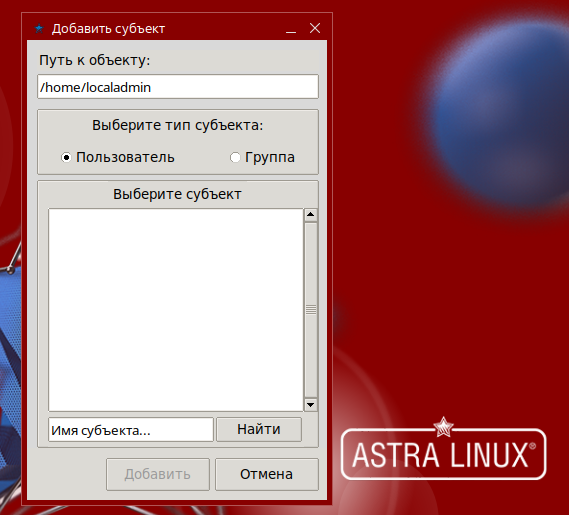
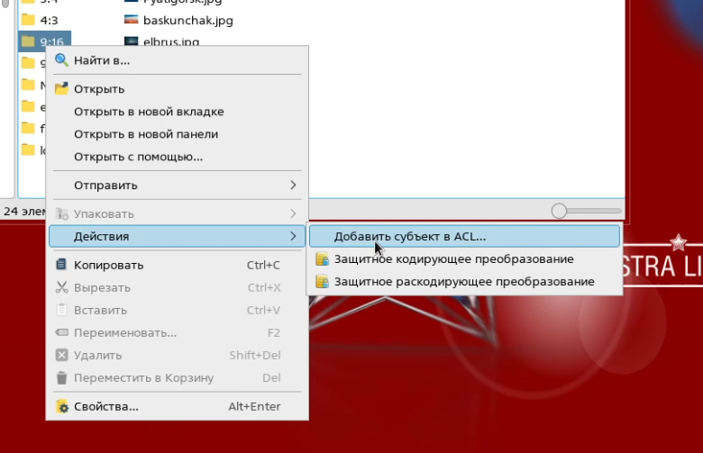
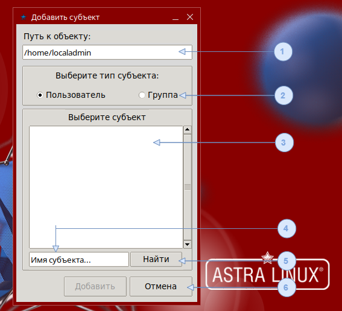
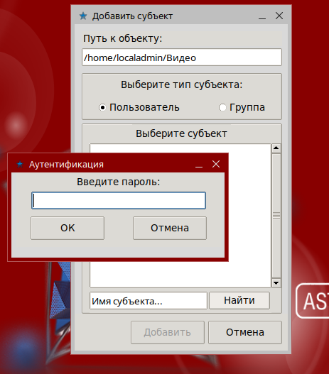
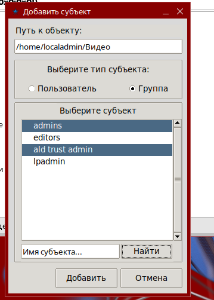
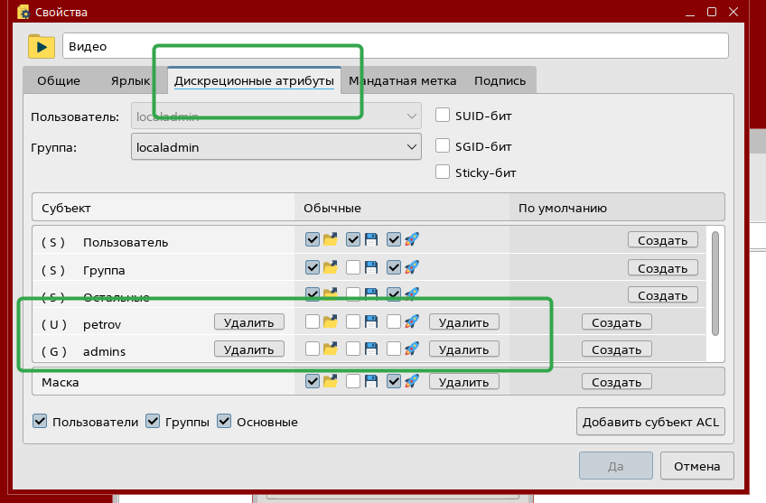

# Утилита aldpro-setfacl для Astra Linux

Графическая утилита aldpro-setfacl упрощает процедуру добавления субъектов безопасности домена ALD Pro (FreeIPA) в списки доступа ACL объектов файловой системы Astra Linux.



После установки пакета в контекстном меню файлового менеджера fly-fm появится команда "Действия > Добавить в ACL".



## История изменений

### Версия 1.0

Реализованы базовые функции утилиты, обеспечивающие добавление субъектов домена в ACL объектов файловой системы.

## Сборка утилиты

Для запуска утилиты установите из официальных репозиториев ALSE следующие пакеты:

```
sudo apt install python3-tk python3-ldap python3-xlib python3-systemd
```

В целях отладки утилиту можно запускать из терминала следующей командой:

```
python3 opt/rbta/aldpro/aldpro-setfacl/__main__.py <путь_к_объекту>

```

Для сборки deb-пакета выполните в каталоге проекта следующую команду: 

```
debuild -us -uc -b
```

Для установки deb-пакета на рабочей станции используйте команду:

```
sudo apt install ./aldpro-setfacl_1.0-1_amd64.deb
```

Основной код программы будет помещён в каталог */opt/rbta/aldpro/aldpro-setfacl/*. Для возможности быстрого вызова утилиты по короткому имени в каталог */usr/sbin/* будет помещен одноименный исполняемый скрипт *aldpro-setfacl*

Для интеграции с файловым менеджером fly-fm в каталоге */usr/share/flyfm/actions/* будет создан ярлык *aldpro-setfacl.desktop*.

## Использование



В основном окне приложения есть следующие элементы интерфейса:

1. Текстовое поле содержит полный путь к объекту файловой системы, в ACL которого будут добавлены выбранные субъекты домена
2. Переключатель позволяет выбрать тип субъектов, по которым будет выполнен поиск в домене
3. Список субъектов, найденных в домене по указанным критериям
4. Строка поиска
5. Кнопка "Найти" запускает процедуру поиска в домене. 
6. Кнопки управления, которые позволяют добавить выбранные субъекты или закрыть окно приложения.

Если в связке ключей не окажется действительного TGT-билета пользователя, то по нажатию кнопки "Найти" откроется окно для выполнения Kerberos-аутентификации. Пользователю нужно будет ввести пароль от своей доменной учетной записи.




После успешного выполнения поиска в списке субъектов отобразятся найденные результаты:



Выберите один и несколько субъектов из списка, используя клавиши Ctrl и Shift, и нажмите кнопку *"Добавить ACL"*.

После добавления субъектов в ACL вы можете перейти к свойствам объекта для настройки прав доступа. Вкладка *"Дискреционные атрибуты"* откроется автоматически, у только что добавленных субъектов не будет никаких прав доступа:


